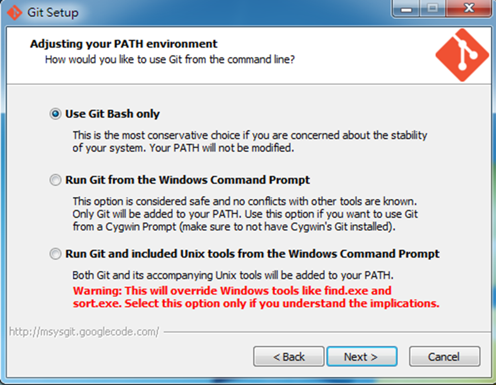
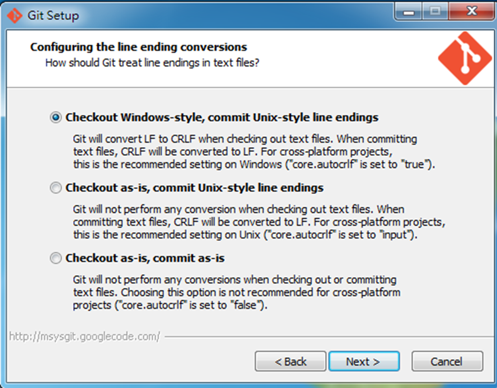
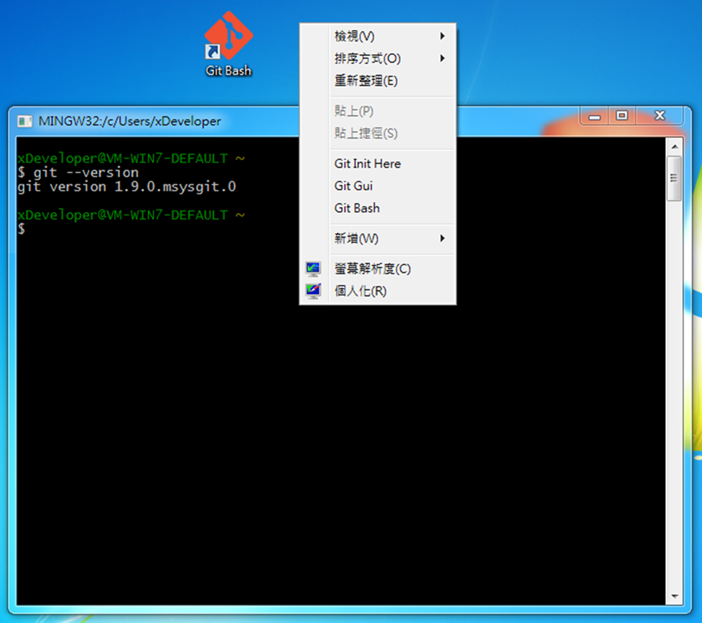

.. _Ch0-install-setup-git:
  
0.2 安裝與設定 Git
=====================================

.. note:: 本書關於 Git 與 Android 開環環境是假設建基在 Windows-based (e.g. Windows 7/8)的系統下；如為 Linux (e.g. Ununtu/Fedora)、Mac 等其它系統，則可參考該系統相關的安裝指引。

在 Windows 環境下使用 Git，必須先安裝核心組件－msysGit。安裝完成後即可在命令列模式輸入 Git 指令，或是利用它內建的圖形界面操作 Git。

本書所有案例操作會同時以命令列 (command promprt)與圖形使用者界面 (GUI, Graphic User Interface)兩種模式，來說明如何執行 Git 操作。

命令列模式即是開啟「命令提示字元」視窗，並輸入 Git 指令；而圖形界面則以整合在 Eclipse 內的 eGit \ [#]_\ 來執行 Git 。

.. note:: 雖然安裝完 msysGit 即有圖形界面，但是它作得很粗糙；所以若不是開發 Eclipse 並使用 eGit 的 Windows 使用者，會選擇另一套更友善的圖形使用界面－TortoiseGit。

  不過要注意，TortoiseGit 只是 Git 的一種圖形前導 (frontend)界面，所以仍須先安裝完 msysGit 才能執行 Git 指令。
  
  無論 msysGit、TortoiseGit、eGit，甚或其它第三方 Git Client，彼此之間並不會有任何衝突，都可以對同一 Git 儲庫執行 Git 指令。與其它版本控制系統不一樣的就是，所有的 Git Client 其實僅是 Git 原生組件 (component)的「包裹 (wrapper)」而以，它們其實都是操作同樣的 Git 核心組件。
  
.. [#] eGit 是已內建於 Eclipse 的 Git 套件，它可以透過 Eclipse 的界面直接操作 Git 指令。下一節會說明如何設定 eGit 組態。

安裝與設定 msysGit
-----------------------

1. 下載與安裝

  至 *http://msysgit.github.io/* 下載最新版本 (本書使用版本為 *Git-1.9.0-preview20140217.exe*)並執行安裝程序。
  
2. 安裝過程中，大都採以預設選項即可。

* 預設選擇「Use Git Bash Only」，則只在 msysGit 所提供的 Shell 模式內執行；後面兩個選項則會將 Git 甚或所伴隨的工具加入 Windows 命令模式的 PATH 環境變數，如此有可能會影響到其它應用程式的執行。

   圖0-2-1：調整系統 PATH 環境變數

* 關於文字檔的換行符號，一般選擇預設的第一個選項 (LF 轉換為 CRLF)，這在跨平台的專案是比較建議的設定。

   圖0-2-2：設定文字檔換行符號

3. 安裝完成後，可以執行位於桌面圖示的「Git Bash」，或按下滑鼠右鍵出現的功能表即有 Git 相關的指令。

  Git Bash 是屬於 Linux-Like 的 Shell 界面，所有 Git 的相關指令即在此輸入。試著輸入：::
  
    git --version
  
  若安裝沒有問題，則會回應 Git 的版號。
  

   圖0-2-3：執行 GIT Bash

