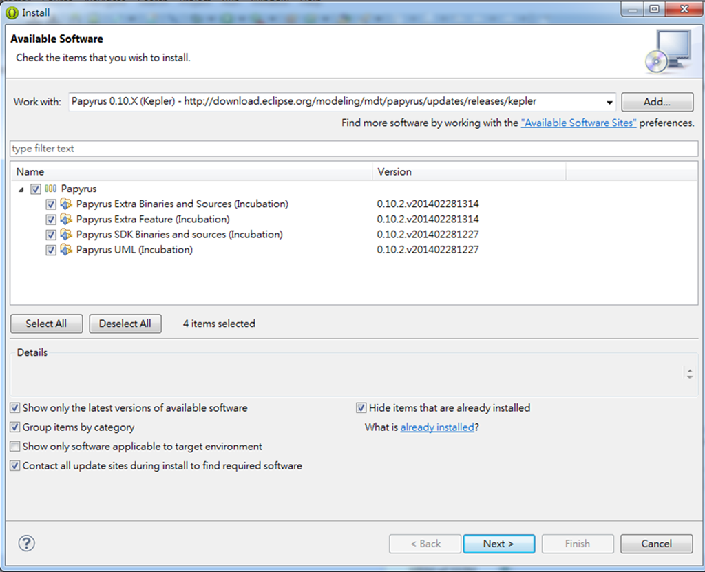
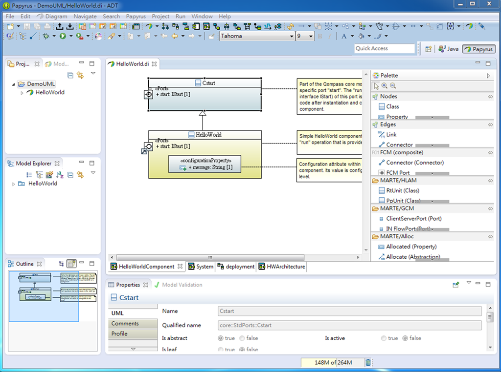

.. _Ch0-build-android-develop-environment:

0.2 建置開發環境
========================

安裝 Android 開發工具
----------------------

Android App 開發環境只要設置下列兩個開發套件即可：

* Java SE (Standard Edition)。
* ADT (Android Development Tools) Bundle。

Java SE
`````````````````````

Android App 是以 Java 語言撰寫的，自然需先下載 JDK (Java Development Kit) 的編譯環境。

請至 *http://www.oracle.com/technetwork/java/javase/downloads/index.html* 下載 JDK 最新版本；注意下所對應的作業系統、以及 32或64 位元的版本檔案，然後下載直接執行安裝即可。

本書為 Windows 7 x64 的開發環境，最新的穩定版本為 JDK 7，所下載的參考檔案名稱為 *jdk-7u51-windows-x64.exe*。

ADT Bundle
`````````````````````

Google 已為 Android 開發人員準備了一套完整的開發套件－ADT Bundle，可讓開發人員不用再各別安裝與設定開發環境，降低 App 開發的門檻。

關於 Android 開發工具，可參考其開發人員首頁 *https://developer.android.com/sdk/index.html* 獲取更多相關資訊。

ADT Bundle 包含了下列幾個開發套件：

* Eclipse + ADT plugin。
* Android SDK Tools。
* Android Platform-tools。
* The latest Android platform。
* The latest Android system image for the emulator。

下載與設定 ADT Bundle
^^^^^^^^^^^^^^^^^^^^^^

在上述的網頁，點選【Download】下載取得 SDK ADT Bundle for Windows (32/64 位元)。


將所下載的壓縮檔 (檔名為 *adt-bundle-<os_platform>.zip*) 解壓縮至合適的位置內並可更名較簡短的資料夾名稱 (e.g. *C:\adt-bundle-windows*)。

開啟資料夾內 */eclipse/* 目錄並執行 eclipse.exe，設定工作區 (workspace)專案儲存目錄 (e.g. *C:\Projects\workspace*)，如此即完成 ADT 的初始配置。
 

設定 Eclipse EGit
----------------------
  
什麼是 EGit？
`````````````````````
  
EGit 是 Eclipse 的一個團隊提供者 (team provider)套件，它可以讓開發人員直接在 Eclipse IDE 環境內使用 Git 版本控制系統。
  
EGit 是基於 JGit 套件 (library)所發展，而 JGit 係以 Java 來實現 Git 完整功能的輕量級 (lighweight)套件庫。
  
安裝 EGit
`````````````````````
  
自 Eclipse 4.2 以後版本，EGit 已成為核心組件，並不需要另行安裝；而若使用 Eclipse 較舊版本，則 EGit 是被視為外掛 (plug-in)，可以透過 Eclipse 安裝管理員 (installation manager)安裝。
  
在 Eclipse 選單上點選【Help】→【Install New Software...】，在出現的對話框內，輸入下列 URL 位址：
  
::
  
 http://download.eclipse.org/egit/updates
  
然後按照對話框提示的訊息完成安裝。
  
.. figure:: imgs/ch0-install-egit-plugin.png
   :width: 1024 px
   :height: 881 px
   :scale: 50 %
   :alt: 安裝 EGit 外掛
   :align: center
  
   圖0-3-1：安裝 EGit 外掛
  
設定 EGit 基本組態
`````````````````````
  
* 設定 Git 使用者資訊
    
  在使用 EGit 之前，需要先設定好使用者資訊，包括 姓名、電子郵件，這些會成為後續創建儲庫時的提交資訊。
  
  Eclipse 選單上點選【Window】→【Preferences】→【Preferences】，在出現的對話框點選【Team】→【Git】→【Configuration】，即可以設定預設的使用者資訊。
  
  .. figure:: imgs/ch0-setup-egit-configuration.png
     :width: 1024 px
     :height: 758 px
     :scale: 50 %
     :alt: 設定 EGit 使用者資訊
     :align: center
  
     圖0-3-2：設定 EGit 使用者資訊
  
  EGit 使用者資訊並非置於 Eclipse 組態資訊內，而是儲存在預設的 Git 組態檔，例如 Windows 系統是位於 C:\Users\使用者帳戶\.gitconfig。這是為了讓原生 (Native)的 Git 機制，也能使用相同的使用者資訊。
  
  .. note:: 關於所填入的電子郵件帳戶，最好能與在 GitHub 上申請的帳號一致，如此會便於區域端與遠端儲庫的同步作業。
  
* 設定 Git 預設儲庫位置

  預設的儲庫位置也可以修改，在【Preferences】對話框，點選【Team】→【Git】，在【Default Repository Folder】選擇預設的儲庫位置。
  
  .. note:: 這裡也可以使用 Eclipse 組態變數 (configuration variables)定義儲庫路徑，例如想把 git 預設儲庫置於 Eclipse workspace 目錄下，就可以填入 ${workspace_loc}/git。(關於預設的變數可以點選【Variable...】選擇)
  
  .. figure:: imgs/ch0-setup-egit-default-repository.png
     :width: 1024 px
     :height: 786 px
     :scale: 50 %
     :alt: 設定 EGit 預設儲庫位置
     :align: center
  
     圖0-3-3：設定 EGit 預設儲庫位置
     
* 啟動 Git 工具列

  為了可以更方便操作 Git，可以在主選單上啟動 Git 工具列 (toolbar)。點選【Window】→【Customize perspective...】，在出現的對話框，切換至【Command Groups Availability】標籤，然後點選 Git 與 Git Navigation 兩個選項。(記得在【Window】選單上要先點選【Show Toolbar】)
  
  .. figure:: imgs/ch0-setup-egit-toolbar.png
     :width: 1024 px
     :height: 811 px
     :scale: 50 %
     :alt: 設定 EGit 工具列
     :align: center
  
     圖0-3-4：設定 EGit 工具列
	 
安裝 Papyrus UML Plugin (選擇性)
---------------------------------

本書案例關於 UML 塑模 (modeling)的文件均是以 Papyrus UML 工具繪製的。Papyrus 是被歸類於 Eclipse 塑模工具套件內 (package)的外掛，它完全免費，可以直接透過 Eclipse 的安裝管理員下載並完成安裝。

參考該外掛首頁 *http://www.eclipse.org/papyrus/updates/index.php*，以查詢插件最新釋出與所對應 Eclipse 版本的安裝網址，然後在 Eclipse 選單上點選【Help】→【Install New Software...】，在出現的對話框內，輸入 URL 位址 (本書使用 Papyrus 0.10.X / Eclipse Kepler)：

::
  
 http://download.eclipse.org/modeling/mdt/papyrus/updates/releases/kepler
 


   圖0-3-5：安裝 Papyrus UML 插件
   
然後按照對話框提示的訊息完成安裝。

也可以試著切換視界 (perspective)至【Papyrus】並新增 Papyrus 專案，然後再新增內建的範例檔如「Hello World」，來觀察所開啟的 UML 各類型的設計圖。



   圖0-3-6：Papyrus Hello World UML 範例
   
.. note:: 本書關於 UML 塑模的分析與設計，僅是為了便於以圖例方式說明案例系統功能的需求分析與 Java 物件的基本結構設計；這些設計圖與程式碼並沒有絕對的直接關連 (與 Git 安裝也沒有關係)，所以讀者也可以略過這些設計圖而直接閱讀程式碼。

  另外一個作用就是把該塑模檔當成設計文件，並同時可與程式碼一併交由 Git 作版本管理。這對一個小型系統的專案開發而言，可以整合設計文件與程式碼並交由版本系統管理，相當便利。