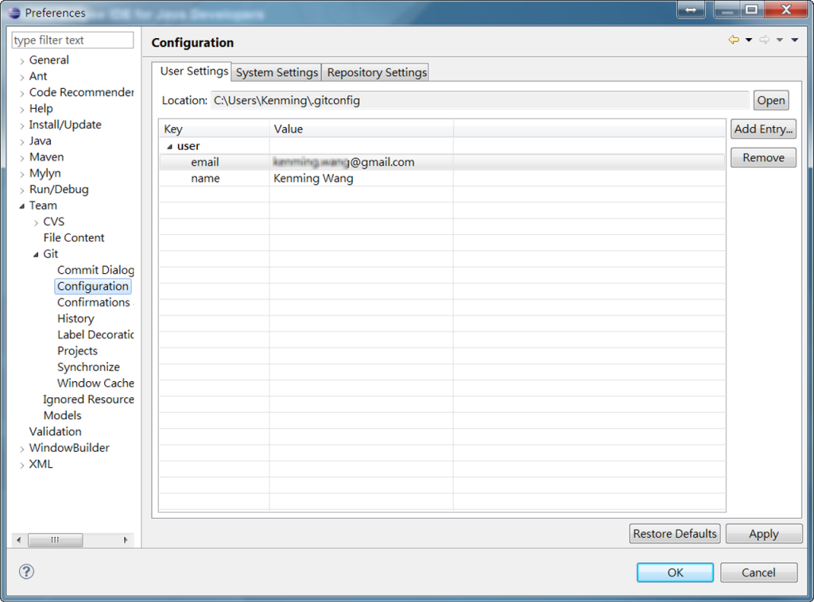
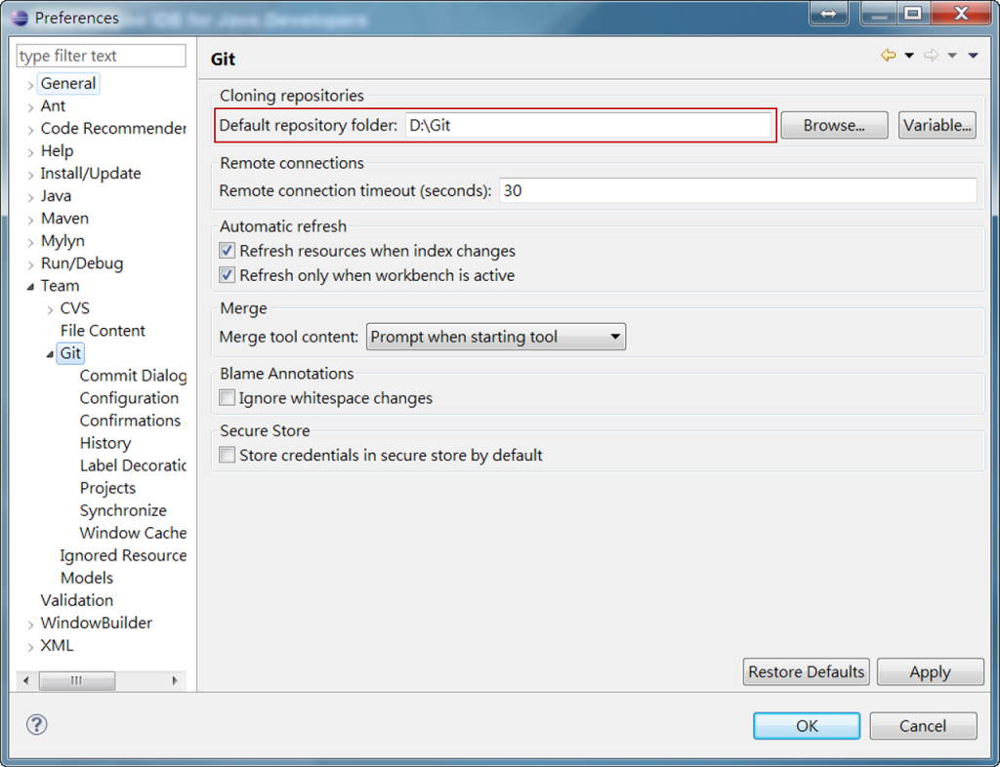
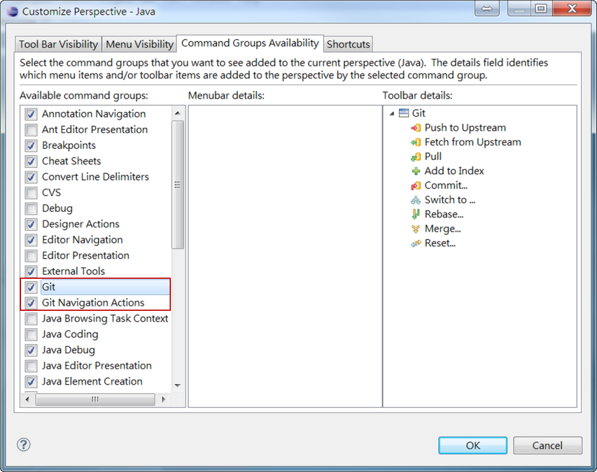

.. _Ch0-setup-eclipse-egit:

0.3 設定 Eclipse EGit
=====================================

什麼是 EGit？
----------------------------

EGit 是 Eclipse 的一個團隊提供者 (team provider)套件，它可以讓開發人員直接在 Eclipse IDE 環境內使用 Git 版本控制系統。

EGit 是基於 JGit 套件 (library)所發展，而 JGit 係以 Java 來實現 Git 完整功能的輕量級 (lighweight)套件庫。

安裝 EGit
----------------------------

自 Eclipse 4.2 以後版本，EGit 已成為核心組件，並不需要另行安裝；而若使用 Eclipse 較舊版本，則 EGit 是被視為外掛 (plug-in)，可以透過 Eclipse 安裝管理員 (installation manager)安裝。

在 Eclipse 選單上點選【Help】→【Install New Software...】，在出現的對話框內，輸入下列 URL 位址：

::

 http://download.eclipse.org/egit/updates

然後按照對話框提示的訊息完成安裝。

.. figure:: imgs/ch0-install-egit-plugin.png
   :width: 1024 px
   :height: 881 px
   :scale: 50 %
   :alt: 安裝 EGit 外掛
   :align: center

   圖0-3-1：安裝 EGit 外掛

設定 EGit 基本組態
----------------------------

設定 Git 使用者資訊
^^^^^^^^^^^^^^^^^^^^^^^^^^^^

在使用 EGit 之前，需要先設定好使用者資訊，包括 姓名、電子郵件，這些會成為後續創建儲庫時的提交資訊。

Eclipse 選單上點選【Window】→【Preferences】→【Preferences】，在出現的對話框點選【Team】→【Git】→【Configuration】，即可以設定預設的使用者資訊。

   圖0-3-2：設定 EGit 使用者資訊

EGit 使用者資訊並非置於 Eclipse 組態資訊內，而是儲存在預設的 Git 組態檔，例如 Windows 系統是位於 C:\Users\使用者帳戶\.gitconfig。這是為了讓原生 (Native)的 Git 機制，也能使用相同的使用者資訊。

.. note:: 關於所填入的電子郵件帳戶，最好能與在 GitHub 上申請的帳號一致，如此會便於區域端與遠端儲庫的同步作業。

設定 Git 預設儲庫位置
^^^^^^^^^^^^^^^^^^^^^^^^^^^^

預設的儲庫位置也可以修改，在【Preferences】對話框，點選【Team】→【Git】，在【Default Repository Folder】選擇預設的儲庫位置。

.. note:: 這裡也可以使用 Eclipse 組態變數 (configuration variables)定義儲庫路徑，例如想把 git 預設儲庫置於 Eclipse workspace 目錄下，就可以填入 ${workspace_loc}/git。(關於預設的變數可以點選【Variable...】選擇)

   圖0-3-3：設定 EGit 預設儲庫位置
   
啟動 Git 工具列
^^^^^^^^^^^^^^^^^^^^^^^^^^^^

為了可以更方便操作 Git，可以在主選單上啟動 Git 工具列 (toolbar)。點選【Window】→【Customize perspective...】，在出現的對話框，切換至【Command Groups Availability】標籤，然後點選 Git 與 Git Navigation 兩個選項。(記得在【Window】選單上要先點選【Show Toolbar】)

   圖0-3-4：設定 EGit 工具列