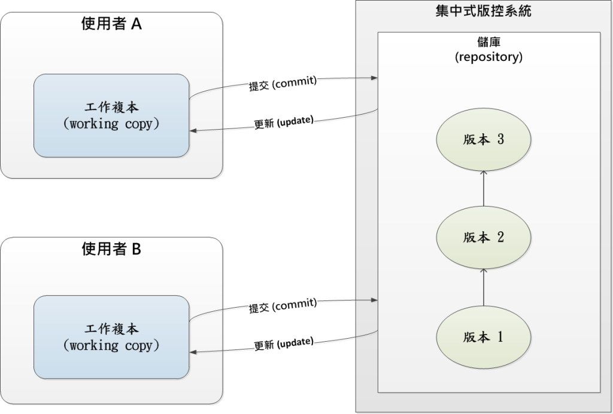
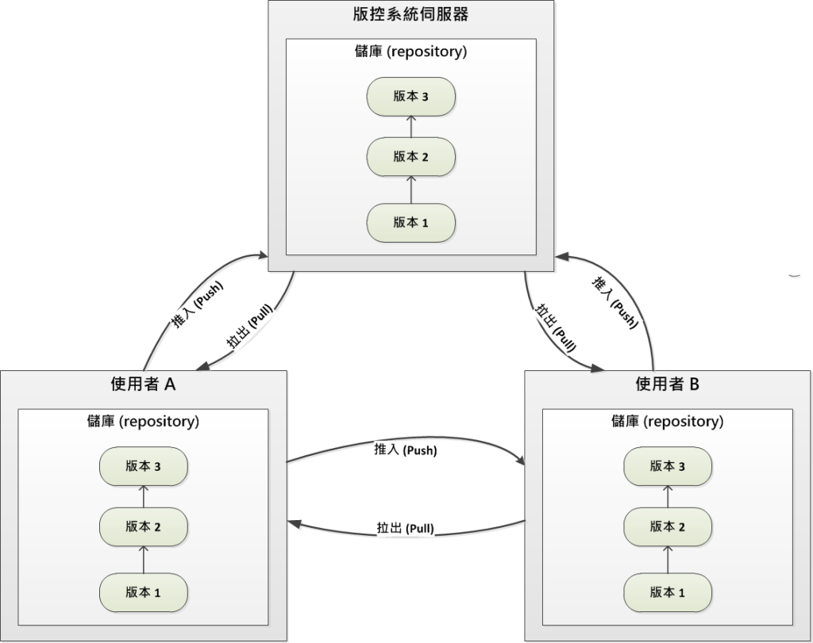

1.1 關於版本控管
========================

版本控制 (version control)，係針對電子化的檔案，包括文件 (document)、程式碼 (source code)、與其它需被整理保存的資訊等，對其變動情形作有效的追蹤管理。

對於軟體開發過程，軟體開發者利用版本控制來追蹤、維護程式碼、設計文件、設定檔等變動情形；尤其是當面臨多人協同開發時，相關設計的文檔必然會複製多份版本分散置於每一位開發人員的電腦內，只要其中一份版本因功能或除錯 (features or bugs)問題經變更後，則位於其他電腦內的版本也必須保持其一致性。

這種頻繁且複雜的變動管理追蹤，幾乎是無法透過手動方式來管理的，自然而然，一個好的版本控制系統 (version control system, VCS)，就要能擔負起下列的管理工作：

* 對於所有團隊成員們的開發文檔 (尤其係指程式碼)，要能保持一致性 (consistent)。
* 因為錯誤的修改或遺失檔案，可以很輕易地回溯 (revert)至原來的狀態。
* 任何再細小的變動，都可以知道是誰做了修改。
* 可以輕易地部署 (deploy)不同版本的程式碼至開發或產品的伺服器內。
* 團隊所有成員甚至可以利用 VCS 當成相互溝通的媒介。

儲庫 (Repository)
------------------------

儲庫\ [#]_\ 是版本控制系統的核心組件 (core component)。它是一種資料倉儲的概念，主要儲存著下列的資訊：

* 一組具階層性 (hirarchy)的檔案與資料夾結構。
* 儲庫內的歷史性變更紀錄 (historical record of changes)。
* 一組提交的資訊與指向該提交的指標，稱之為表頭 (head)。

簡而言之，版本控制系統的儲庫就是儲存著多個版本的文檔資訊。

基於儲庫的位置所在，可以大致區分為兩種類型的版本控制架構。

集中式版本控制
------------------------

集中式版本控制 (Centralized Version Control)是典型的「主從 (Client/Server)」 架構。記錄著多個版本檔案的儲庫是置於單一的伺服器內，並提供給具有存取權限的多個用戶端從伺服器提取檔案，所有的變更與提交等資訊均必須在連線到伺服端後才得以完成工作。

最普為人知且為免費開源的集中式版本控制系統，就屬 CVS、Subversion 為代表，並幾以成為業界所熟悉的版本控制標準模式了。

   圖1-1：集中式版控系統模型
   
參考上圖1-1，集中式版控系統只有一個儲庫，是位於伺服器內。用戶端連線後發出 update 更新指令，就會從中央儲庫內複製一份工作複本 (working copy)至區域端電腦內；當開發者新增或變更檔案內容後，則需要提交 (commit)至伺服器的儲庫內；當儲庫與工作複本的檔案內容有不一致發生衝突 (conflicts)的現象時，則需要作合併 (merge)的動作。

集中式的優點就是「容易管理」，因為畢竟管理者只需面對單一的伺服器，對於使用者的存取權限與版本規劃，會相對容易許多。再則這種概念也容易讓開發與管理人員理解，因為主從式架構已深植於人心多年，業界早已習慣這樣的模式。

然而集中式有些相當麻煩的缺點。當伺服器當機而導致用戶端無法連線時，開發人員就無法儲存變更的版本資訊，整個協同開發也就無法進行；再則最嚴重的就是伺服端的硬碟絕不能損毀 (如果沒有備援機制，那就慘了！)，因為所有的歷史提交資訊都儲存在伺服器上，如果無法回復版本歷史資訊，那麼版本控制也就沒有存在的意義了；最後一個問題是，因為每一次的提交命令都需要連線到伺服端上，所以效能上也會較慢。

分散式版本控制
------------------------

分散式版本控制 (Distributed Version Control)是這五六年來新興的一股另類選擇，而且看來很可能會取代原來集中式的主從架構，成為主流的標準。它完全顛覆了集中式的做法，分散式的儲庫是置放在每一個開發人員的電腦內，每一個儲庫都擁有完整的檔案與版本資訊，這些儲庫都是完整的備份映像 (mirror)，即使放置在所謂的 Git Server 儲庫毀損，也只要從任一用戶端的電腦將儲庫複製回伺服端就可以完全還原。

分散式版控系統的代表有 Git, Mercurial, Bazaar 等，其中 Git 最普為人知，因為它是由 Linux 之父托瓦茲開發，且以 Git 為版本機制的 Web 託管服務 (web hosting service)廠商擁有廣大的用戶數，這也是 Git 普及的主要原因。

   圖1-2：分散式版控系統模型

參考上圖1-2，無論在伺服器或使用者工作電腦上，都有一份完整的儲庫。使用者自行維護工作電腦內的儲庫 (包括版本控制與分支管理等)，待工作內容告一段落，則可以將更新內容推入 (push)至遠端電腦的儲庫；反之利用拉回 (pull)來擷取 (fetch)與合併 (merge)遠端電腦的儲庫更新內容。
   
分散式的主要優點就是強調它的「分散」，每一位開發人員都是自己儲庫的主人，想要隨時作變更提交、發布新版本、貼上標籤 (tag)等，都可以輕而易舉的在自己的電腦上完成，一點也不用受到網路連線的影響。等到開發者覺得自己儲庫的版本可以告一段落 (可能已記錄了多份版本)，然後才與位於伺服端的儲庫作同步 (sync)即可；還有分散式處理的速度很快，所以它可以輕易地應付頻繁的改版，甚至官方組織還鼓勵這樣作，如此也能實現「每日建構 (daily build)」的好習慣。

分散式的缺點是畢竟它是這幾年才發展出來較新穎的架構，所以在觀念上較難理解；還有用戶端的工具介面與功能設計上也較少選擇性。這些問題假以時日應該是隨著普及性與工具的成熟性，而得以解決的。

簡單結論
------------------------

版本控制系統是被用來協助開發人員所面對的：如何有效儲存與分享多個版本的程式碼。所以最基本的要件就是：開發人員真的有在用它。

至於是否是集中式或分散式的版控系統，兩者的差別只在於：影響到開發節奏的順暢度。可能基於成本與工具便利性、習慣性等的考量，只要覺得哪一種系統對團隊能增進開發的節奏，那就先用了再說吧。

----

.. [#] 儲庫與資料庫 (database)都是一種儲存體 (storage)，只不過前者儲存的是檔案的資料結構；而後者則儲存的是原始資料 (raw data)，例如表格式 (table)的關聯性資料。